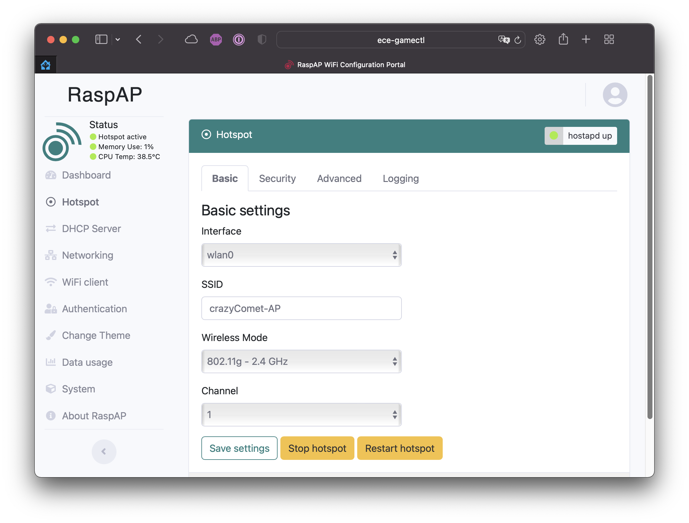
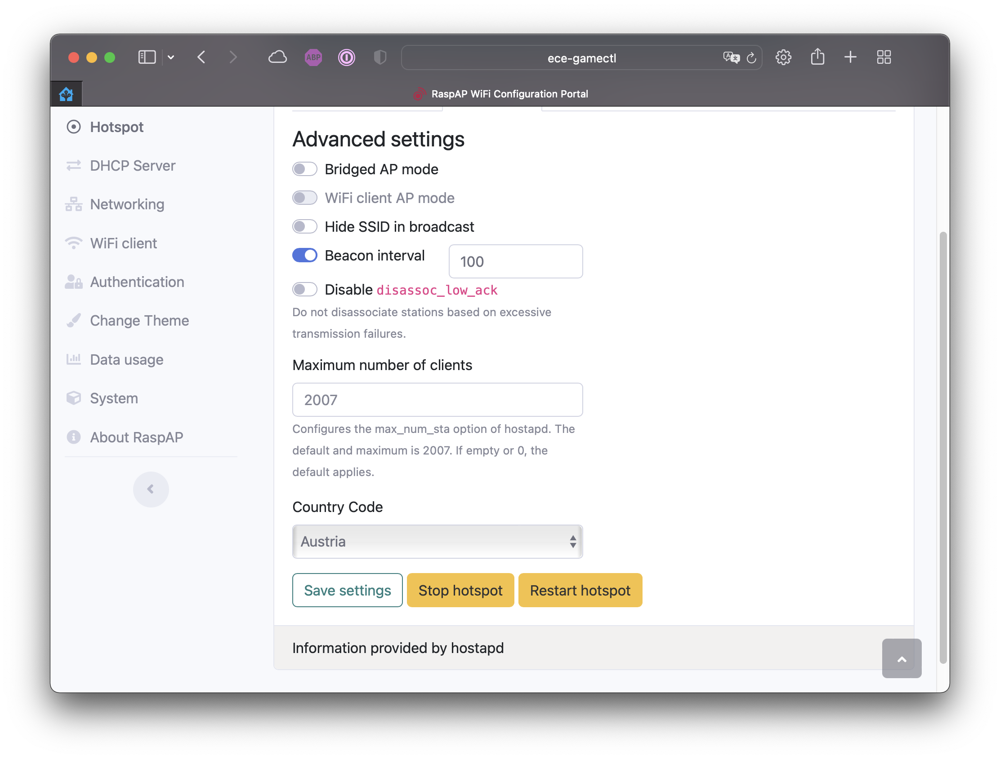

# Gamecontrol setup

Start the gamecontrol by executing *src/main.py* with python

## Installation
### Setup script

To setup everything needed, to run the game there is a setup script, wich can be executed with the following command:

```bash
scripts/pi-setup
```

After this you have to activate I2C by adding `dtparam=i2c_arm=on` to the */boot/config.txt*. For the use with the Adafruit Motorshield the I2C speed needs to be adjusted to $1MHz$. Add `dtparam=i2c_arm_baudrate=1000000` to the */boot/config.txt*. Next the Raspberry Pi needs to be rebooted.

### Manual
#### SDK

The sdk needed to use this program is stored in a submodule. To use it the following commands should be executed:

```bash
git submodule init
git submodule update
```

!!! INFO
    To update the sdk to the latest commit run

    ```bash
    git submodule update --remote --merge
    ```

#### PYTHONPATH
To get nicer imports and automatic documentation add the `src` folder to your `PYTHONPATH`

```bash
export PYTHONPATH="$(pwd)/src:$(pwd)/lib/sdk"
```

#### Python Dependencies

Install all python dependencies run:

```bash
pip3 install -Ur requirements.txt
```

#### I2C

I2C is needed to communicate with the Adafruit Motorshield. It can be activated with a baudrate of $1MHz$ by adding the following lines to the */boot/config.txt*.

```
dtparam=i2c_arm=on
dtparam=i2c_arm_baudrate=1000000
```

!!! INFO
    Those settings are applied with the next reboot.

In addition the following packages need to be installed:

```bash
sudo apt-get install python3-smbus
sudo apt-get install i2c-tools
```

The Adafruit Motorshield can be added to your I2C devices by running:

```bash
sudo modprobe i2c-dev
```

!!! NOTE
    This command needs to be executed after every reboot. When using the *gamecontrol.service* this is done automatically.

#### gpiozero

The GPIO Pins of the Raspberry Pi are controlled with **pigpio** using the **gpiozero** Python library.

Both can be installed using `apt-get`

```bash
sudo apt-get install python3-gpiozero
sudo apt-get install python3-pigpio
```

!!! NOTE
    the pigpio service needs to be enabled after the installation by executing

    ```bash
    pigpiod
    ```

    or

    ```bash
    sudo systemctl enable pigpiod
    sudo systemctl restart pigpiod
    ```

#### Docker

In order to run mqtt docker as well as docker-compose needs to be installed.

*Install Docker*
```bash
curl -fsSL https://get.docker.com -o get-docker.sh
sudo sh get-docker.sh
sudo usermod -aG docker $USER # Add active user to docker group
```

*Install Docker-Compose*
```bash
sudo apt-get install libffi-dev libssl-dev
sudo apt install python3-dev
sudo pip3 install docker-compose
```

#### RaspAP

[RaspAP](https://raspap.com) is used to create a accesspoint to wich all controller can connect. It can be installed with:

```bash
curl -sL https://install.raspap.com | bash
```

!!! INFO
    During the installation you will be asked which extra features you want to install. OpenVPN and Pi-Hole (Ad Blocking) is not needed.

#### MQTT

The mosquitto container can be mounted by running:

```bash
docker-compose up -d
```

## Setup
### MQTT

The default configuration of the mosquitto broker is sufficient for the use with this game. But the setup of a username and password is also supported.
First you have to uncomment `#password_file /mosquitto/pwfile/pwfile` in the `./docker/mosquitto/mosquitto.conf` file and set `allow_anoyamous` to `false`.
Next generate a new user by executing:

```bash
$ docker exec mosquitto mosquitto_passwd -b /mosquitto/pwfile/pwfile <username> <password>
```

### RaspAP

RaspAP can be configured over it's web-gui. First you have to connect to the Wifi Network with the default credentials:

!!! NOTE ""
    **SSID:** raspi-webgui<br>
    **Password:** ChangeMe

Then you can access the control panel by navigating to **10.3.141.1** in your web browser. The default login is:

!!! NOTE ""
    **Username:** admin <br>
    **Password:** secret

#### Change hotspot credentials

The SSID and password of the hotspot can be changed as shown in the pictures below:



??? WARNING "Set the country code"
    Make sure, to set your country code in the advanced hotspot settings.
    

For the settings to take effect, you have to save everything and then restart the hotspot.

#### Change control panel login

The login of the control panel can be changed in the tab *Authentication* as schown in the following picture:


### Autostart

The game can be started automatically using `systemd`. Register the service by executing the script `scripts/systemd-setup`. It takes the name of the service (without .service) as first argument.

**Example for *gamecontrol.service***
```bash
scripts/systemd-setup gamecontrol
```

## Documentation

The Documentation is generated with the help of [mkdocstrings](https://mkdocstrings.github.io/#). To implement a module, class or function into your documentation you have to reference it as follows:

```md
::: library.module

::: library.module.class

::: library.module.function
```